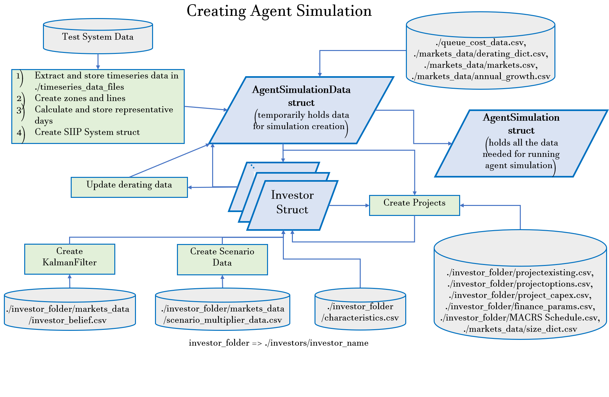

# EMIS AgentSimulation Model

The Electricity Markets Investment Suite Agent-based Simulation (EMIS-AS)
model is an agent-based model developed at NREL for simulating annual investment
and retirement decisions of heterogeneous investors in the electricity sector.
EMIS-AS is designed to capture the evolution of the electricity generation portfolio
resulting from the interactions of heterogeneous investors under different policy
and market designs. EMIS-AS not only allows end-users to customize market products
and rules, but also to capture investors' heterogeneous financing parameters,
technology preferences, beliefs about the future (forecasts), ability to update
those forecasts, and risk preferences under uncertainty.

## Model Structure

EMIS-AS is initialized based on the input data detailing the test system, generation
units, market design, investors' characteristics and simulation parameters. Additionally,
the pre-processing step includes calculation of the weighted average cost of capital 
(WACC) and adjusted CAPEX for all existing and option projects for each investor.
Next, the model selects the specified number of representative days (with hourly 
resolution) to be used by the investors for price prediction. These representative 
days and their corresponding weights are determined based on load and renewable 
generation timeseries using k-medoids clustering.

Subsequently, the simulation commences with successive yearly iterations for the specified
simulation horizon. At the start of each simulation year, the investors project future
prices and make revenue predictions. The predicted revenues are then used to calculate the
expected utility (based on the expected net present value (NPV)) for all projects.
Subsequently, the revenue prediction outcomes and expected utility are used to make
investment and  retirement decisions and for calculation of market bids.

Once all investors have completed their decision-making process, their investment and 
retirement decisions are announced. The model then updates the build-phases of all
projects, which are depicted below.

The projects in the Option phase which get decided to be invested in are sent to the 
interconnection queue and included in the list of active projects. The projects already
in the interconnection queue progress one year further in the queue.
The projects which have completed their queue time then enter the construction phase. It
is assumed that the investors only have to pay the annual queue costs when the projects are
in the queue, but would have to pay the full capital cost once construction commences.
The projects which have completed their construction times are included in the set of existing
projects. Finally, if any project is to be retired, either due to end-of-life or profitability
reasons, is removed from the list of active projects.

The life cycle phase updates are followed by the actual clearing of the modeled electricity 
markets. The current version of EMIS-AS includes energy, ancillary services, capacity and
Renewable Energy Certificates (REC) markets. The investors then update the realized revenues
for their projects and also update their beliefs (using Kalman Filters) based on the realized
values of the parameters. Finally, the derating factors of variable renewable generation 
are calculated based on the updated installed capacities using the top-n net-load hour methodology.

## Loading Data and Simulation Creation

While the model's input data for investors and markets can be instantiated directly as
Julia structs, the model provides a CSV-based file import functionality that may be 
more convenient. Data organized according to the file structure 
[described here](input_file_structure.html) will be automatically populated into a
corresponding `AgentSimulation`. The worklow for processing the input data for creating
the `AgentSimulation` is depicted below.

